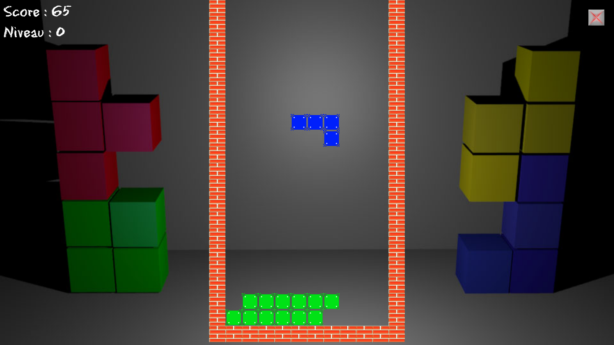

# TetrISN

This repository contains a Tetris game I programmed in 2014. The source code is available in Source/TetrISNamienspython, and was programmed under AmiensPython IDE. A windows executable is also available in Source/TetrISNexecutable.

## Requirements
* Python 2.7
* PyGame
